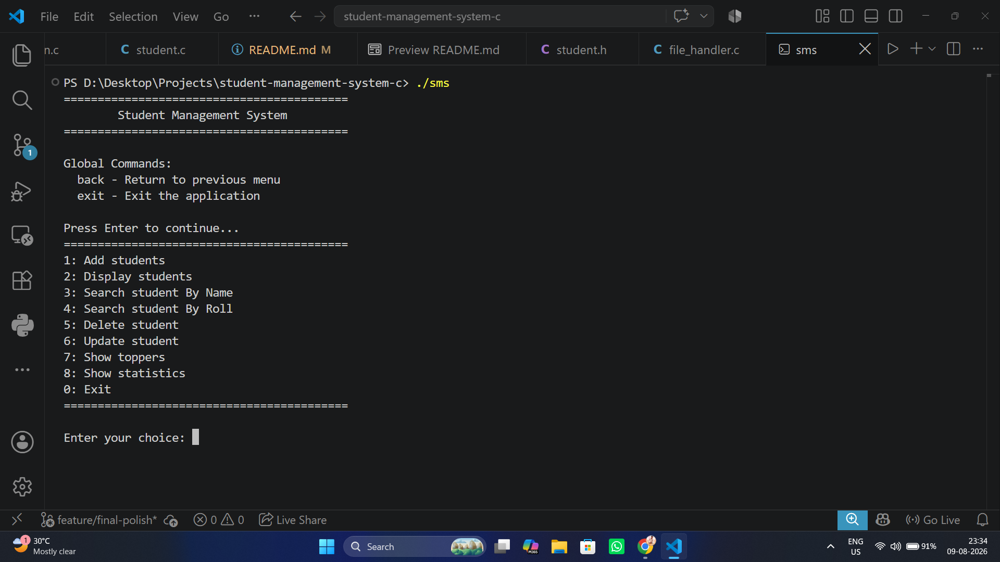
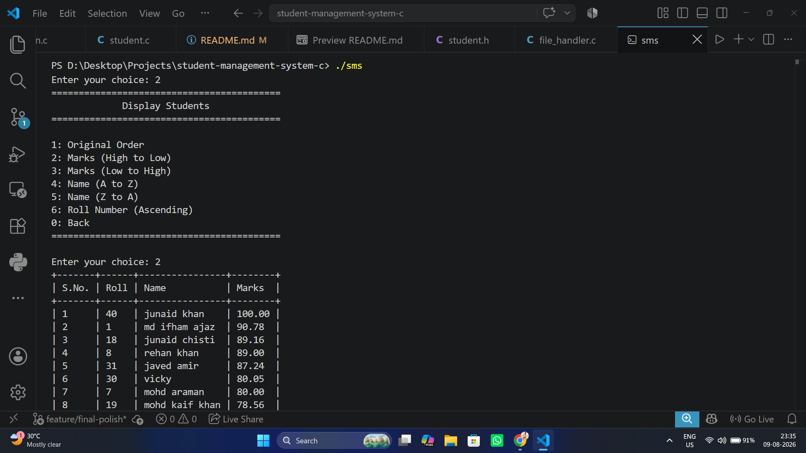
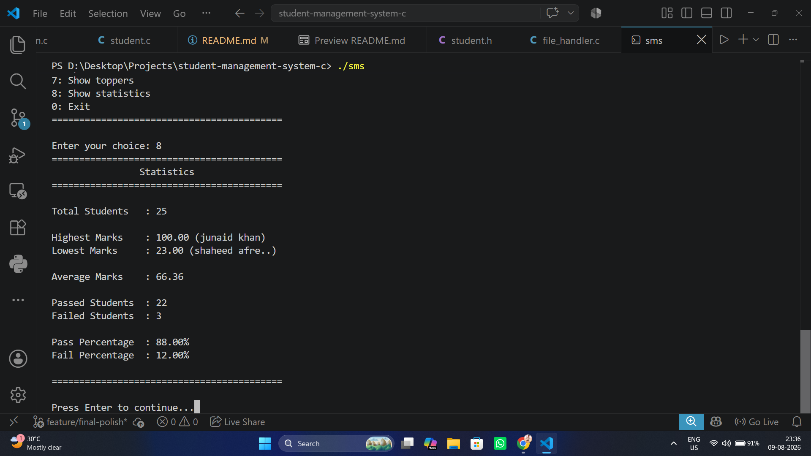
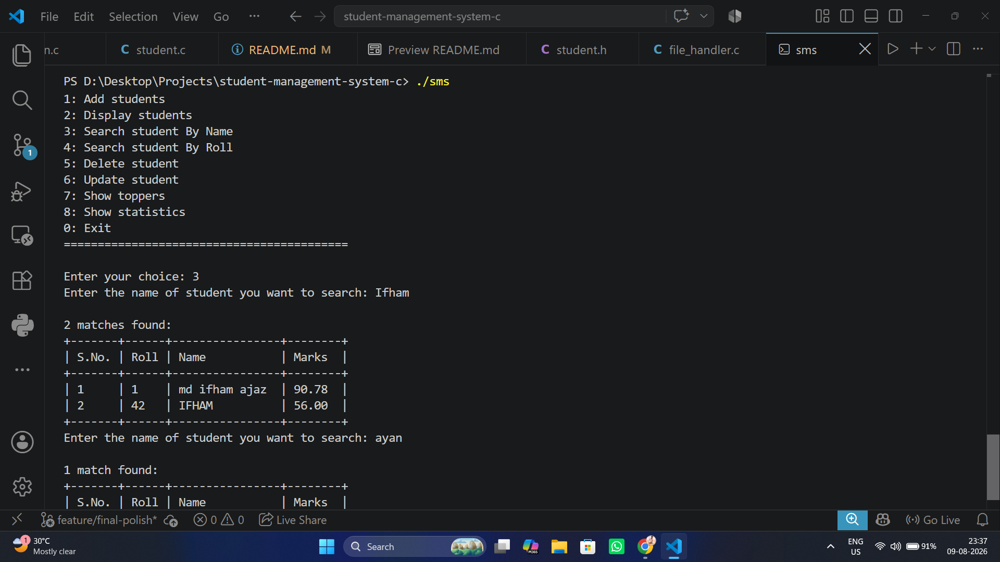

# 🎓 Student Management System — C


## 📌 Overview

This project is part of my C programming learning journey, where I continuously improve the same application as I learn new concepts.

Instead of building multiple small projects, I chose to evolve **one system step-by-step** to understand how real software grows over time, how existing code can be refactored, and how maintainable software is developed.

The project started as a simple student management program and gradually evolved into a modular, dynamically allocated, feature-rich command-line application.

**Current Version: V3.0**

---

## 🚀 Features

### 👨‍🎓 Student Management

- ➕ Add students
  - Name
  - Roll Number
  - Marks
- 📋 Display all students
- 🔍 Search students by Roll Number
- 🔎 Search students by Name
- 🔎 Partial name search
- 🔤 Case-insensitive name search
- ✏️ Update student details
- ❌ Delete student records
- 🆔 Unique roll number validation

### 📊 Student Statistics

The statistics view provides:

- Total number of students
- Highest marks
- Student with the highest marks
- Lowest marks
- Student with the lowest marks
- Average marks
- Number of passed students
- Number of failed students
- Pass percentage
- Fail percentage

### 🏆 Top Performers

- Display top-performing students based on marks
- Ranking-based output
- Sorted in descending order of marks
- Configurable number of top performers

### 🔃 Sorting Views

Students can be displayed using different sorting options:

- Marks — Ascending
- Marks — Descending
- Name — Ascending
- Name — Descending
- Roll Number — Ascending

Sorting is performed on a copy of the student data so that the original stored order is not unnecessarily modified.

### 💾 Persistent Storage

- Binary file storage using `.dat`
- Automatic saving after operations
- Student data persists between program executions
- Data file is automatically created when required

### 🧠 Input & Validation

- `fgets()`-based string input
- Validated integer input
- Validated floating-point input
- Safe handling of oversized input
- Roll number validation
- Duplicate roll number prevention
- Marks validation
- Student name validation
- Partial search support
- Case-insensitive search
- Command support such as `back` and `exit`

### 🖥️ CLI Experience

- Clean command-line interface
- Separate main and display menus
- Reusable tabular output formatting
- Consistent messages and formatting
- User-friendly validation feedback
- Navigation commands
- Ranking and statistics views

---

## 📸 Screenshots

### Main Menu



### Student Display & Sorting



### Statistics



### Search



---

## ⭐ Key Highlights

- Built a complete CRUD application in C
- Evolved the same codebase through multiple versions
- Refactored the application from a basic implementation into a modular architecture
- Replaced fixed-size student storage with **dynamic memory allocation**
- Used `malloc()`, `realloc()`, and `free()`
- Implemented proper memory deallocation
- Migrated input handling from `scanf()` to validated `fgets()`-based input
- Implemented safe integer and floating-point parsing
- Added binary file persistence
- Implemented sorting and ranking functionality
- Added student statistics
- Implemented partial and case-insensitive name searching
- Added reusable tabular output formatting
- Added command-aware input handling
- Improved validation and error handling
- Used Git feature branches throughout V3 development

---

## 🧠 Concepts Used

### C Programming

- Structures
- Pointers
- Pointer-to-pointer
- Dynamic Memory Allocation
- `malloc()`
- `realloc()`
- `free()`
- Arrays
- Functions
- Loops
- Conditional statements
- String handling
- `string.h`
- `ctype.h`

### File Handling

- `fopen()`
- `fread()`
- `fwrite()`
- Binary file handling
- Persistent data storage

### Input & Validation

- `fgets()`
- `strtol()`
- `strtod()`
- Input validation
- Command parsing
- Error handling

### Algorithms

- Selection Sort
- Searching
- Partial string matching
- Case-insensitive string matching

### Software Design

- Modular programming
- Header files
- Include guards
- Multi-file compilation
- Separation of responsibilities
- Reusable utility functions
- Git branching and feature-based development

---

## 🏗️ Project Evolution

This project has evolved continuously as my understanding of C has improved.

```text
V1.0
 │
 ├── Basic student system
 └── Array-based storage
       │
       ▼
V2.0
 │
 ├── Struct-based student records
 ├── Roll numbers
 ├── Marks
 ├── CRUD operations
 └── File persistence
       │
       ▼
V2.1
 │
 ├── Modular architecture
 ├── Multiple source/header files
 ├── File handling module
 ├── Menu module
 └── Improved maintainability
       │
       ▼
V3.0
 │
 ├── Dynamic memory allocation
 ├── Validated fgets-based input
 ├── Command handling
 ├── Improved CLI/output system
 ├── Sorting views
 ├── Top performers
 ├── Statistics
 ├── Partial name search
 ├── Case-insensitive search
 └── Enhanced validation
```

---

## 📂 Data Storage

Student records are stored in:

```text
data/student_data.dat
```

The `data/` directory is tracked using `.gitkeep`.

The generated `student_data.dat` file is ignored by Git and is not included in the repository.

The data file is automatically created when it does not exist.

Student data persists after the program exits and can be loaded again when the application starts.

---

## 📁 Project Structure

```text
Student-Management-System-C/
│
├── data/
│   ├── .gitkeep
│   └── student_data.dat          # Generated at runtime
│
├── include/
│   ├── command.h
│   ├── file_handler.h
│   ├── input.h
│   ├── menu.h
│   ├── output.h
│   ├── sorting.h
│   ├── string_utils.h
│   ├── student.h
│   └── ui.h
│
├── src/
│   ├── command.c
│   ├── file_handler.c
│   ├── input.c
│   ├── main.c
│   ├── menu.c
│   ├── output.c
│   ├── sorting.c
│   ├── string_utils.c
│   ├── student.c
│   └── ui.c
│
├── screenshots/
│   ├── main-menu.png
│   ├── student-list.png
│   ├── statistics.png
│   └── search.png
│
├── .gitignore
├── README.md
└── LICENSE
```

---

## 🛠️ How to Run

### Compile

From the project root:

```bash
gcc src/*.c -Iinclude -o sms
```

### Run on Linux / macOS

```bash
./sms
```

### Run on Windows PowerShell

```powershell
.\sms.exe
```

### Run on Windows Command Prompt

```cmd
sms.exe
```

---

## 📈 Version History

### V1.0

- Basic array-based student system
- Student name handling
- Basic student operations

### V2.0

- Introduced `struct`-based student records
- Added roll numbers
- Added marks
- Added file persistence
- Added unique roll number validation
- Expanded CRUD functionality

### V2.1

- Refactored the application into a modular architecture
- Separated functionality across multiple source and header files
- Added include guards
- Introduced `extern` for shared state
- Implemented multi-file compilation
- Improved maintainability and readability

### V3.0

- Replaced fixed-size student storage with dynamic memory allocation
- Added `malloc()`, `realloc()`, and proper memory deallocation
- Replaced `scanf()`-based input with validated `fgets()`-based input
- Added safe integer and floating-point parsing
- Added command-aware input handling
- Added reusable tabular output formatting
- Added top performer ranking
- Added student statistics
- Added multiple sorting views
- Added partial name search
- Added case-insensitive name search
- Added enhanced student-name validation
- Improved CLI navigation and user feedback

---


## 🎯 Purpose

This project helps me:

- Apply C programming concepts to a real application
- Understand how software evolves over time
- Practice refactoring an existing codebase
- Learn dynamic memory management
- Improve my understanding of algorithms and data handling
- Practice modular software design
- Develop better validation and error-handling habits
- Learn Git-based development workflows
- Build software incrementally instead of starting from scratch every time

The goal was not simply to make the program work, but to continuously improve the same codebase as my understanding of programming grew.

---

## 📚 Learning Journey

This project started as a simple C program and gradually became a significantly more structured application.

Each major version represents a stage in my learning—from basic arrays and functions, to structures and file handling, then modular architecture, dynamic memory allocation, algorithms, validation, and CLI design.

**V3.0 marks the completion of this major phase of the project.**

The next phase of my learning journey will focus on **Java and Object-Oriented Programming**, while continuing to strengthen my programming and software engineering fundamentals.

---

## 🚀 V3.0 Release

**V3.0 is a major milestone for this project.**

The focus of this release was not just adding features, but improving the application's:

- Architecture
- Memory management
- Input safety
- Validation
- CLI experience
- Data handling
- Search capabilities
- Sorting
- Student analysis
- Maintainability

From a basic C program to a modular student management system, this project represents my progression through the fundamentals of C and software development.

---

⭐ If you're also learning C, feel free to explore the project, suggest improvements, or build your own version.

**Happy Coding! 🚀**
